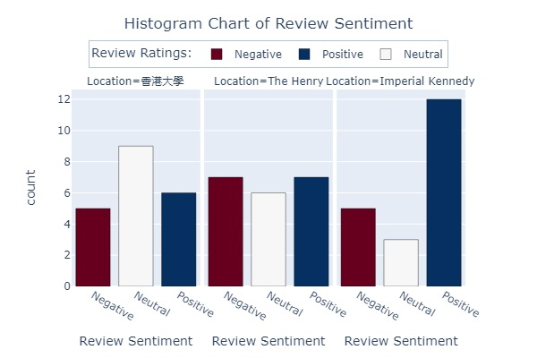
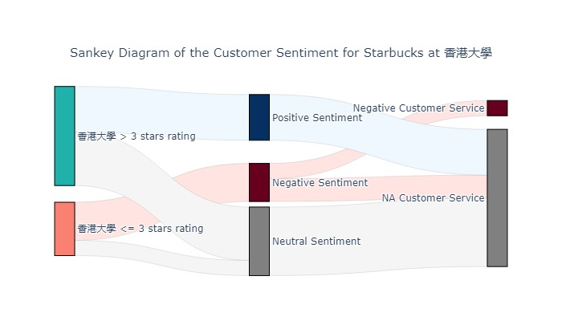
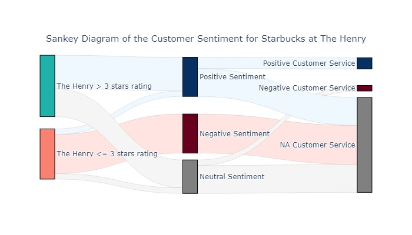
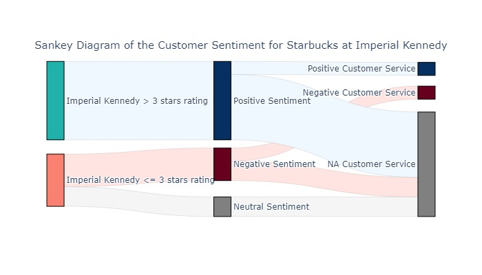

# Starbucks Customer Satisfaction and Sentiment Analysis based on Googlemap Reviews
### Goal:
- Google Maps API was used to automate the extraction of the Google Maps hyperlink for each Starbucks location
- Selenium and BeautifulSoup were used to scrape the Google Maps webpage
- OpenAI API chatgpt model for customer review sentiment analysis

### Steps:
1. Google Maps API was used to automate the extraction of the Google Maps hyperlink for each Starbucks location  
2. Selenium and BeautifulSoup were used to scrape the Google Maps webpage  
    2.1 Before scraping the reviews, the analysis was narrowed down to only the Starbucks location in the western district of Hong Kong Island   
    2.2. Data extracted included review ratings, reviewer's data, and review content. 
3. GPT-3.5-turbo model through OpenAI API was used for sentiment analysis  
4. Data analysis was carried out on Starbucks Review Ratings, Starbucks Review Sentiment and Emotions Expressed in Customer’s Reviews 

### Conclusion:
The insights drawn from this project suggest that while review ratings can be a useful indicator, analyzing the review content provides a more nuanced understanding of customer sentiment and experiences. Additionally, the variance in customer experiences across different locations highlights the need for location-specific analysis and improvements. By identifying specific emotions expressed in the reviews, it may be possible to better understand the underlying experiences and address issues that contribute to negative emotions.
 
 
</img> 
 
 
</img> 
 
 
</img> 
 
 
</img> 
 
 
